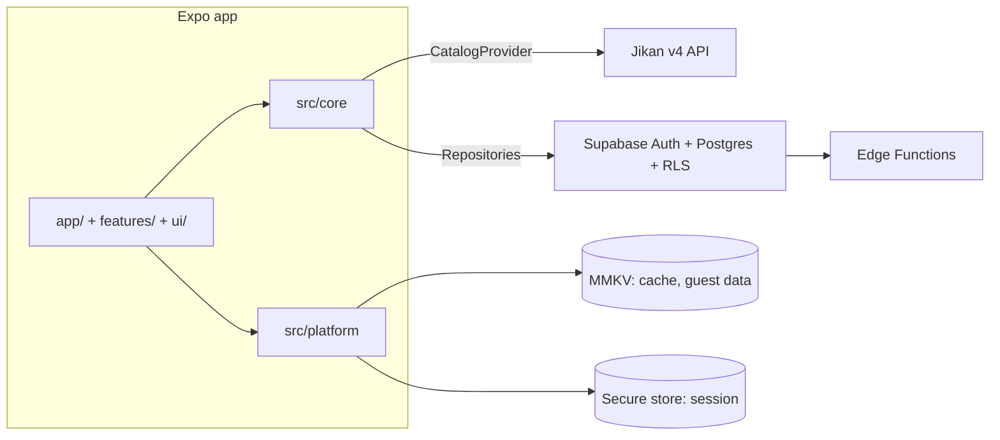
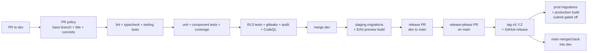

# Architecture

This document describes how Tsuzuki is built. Decisions and their rationale live in [`adr/`](./adr). Keep this file in sync with the code: any structural change updates it in the same PR.

## 1. Overview



- The **catalog** (titles, search, discovery) comes from an external provider, today Jikan, behind the `CatalogProvider` interface.
- **User data** (library, favorites, preferences) lives in Supabase for signed-in users, and in MMKV for guests.
- The app never talks to a provider or to Supabase outside `src/core/`.

## 2. Folder structure

```
tsuzuki/
├── app/                              # expo-router routes (thin)
│   ├── _layout.tsx                   # composition root: app env, error reporter, storage, persisted query client, preferences, i18n, theme + root Stack (supabase client wired with its first consumer, §8)
│   ├── (tabs)/
│   │   ├── _layout.tsx               # Tabs from expo-router/js-tabs, five tabs
│   │   ├── index.tsx                 # discovery, the route /
│   │   ├── search.tsx
│   │   ├── library.tsx
│   │   ├── favorites.tsx
│   │   └── settings.tsx
│   ├── media/[kind]/[id].tsx         # media detail: raw params passed to the feature screen
│   ├── +not-found.tsx                # unmatched links: translated error, back to Discover
│   └── (auth)/sign-in.tsx, sign-up.tsx
├── src/
│   ├── core/                         # platform-agnostic, shareable with a future Next.js app
│   │   ├── domain/                   # entities, business rules (BR-xx), content filter
│   │   │   └── media.ts              # MEDIA_KINDS, MediaKind, MediaKey, MAL_ID_MAX, isMediaKind
│   │   ├── schemas/                  # zod schemas for user input, route params and db rows
│   │   │   ├── media-route-params.ts # media detail route params { kind, id } -> MediaKey, parseMediaRouteParams
│   │   │   └── app-env.ts            # build-time env (variant, https supabase url, anon key, optional sentry dsn), shared by app.config.ts and the startup reader (§10)
│   │   ├── catalog/
│   │   │   ├── catalog-provider.ts   # CatalogProvider interface + normalized types
│   │   │   ├── catalog-provider-id.ts # CATALOG_PROVIDER_IDS ('jikan'), CatalogProviderId, used in query keys
│   │   │   ├── rate-limiter.ts       # token bucket + request dedup
│   │   │   └── jikan/                # jikan adapter: http client, zod schemas, mappers, fixtures
│   │   ├── repositories/
│   │   │   ├── storage-adapter.ts    # StorageAdapter: synchronous string key-value storage, never secrets (MMKV on mobile)
│   │   │   ├── session-storage.ts    # SessionStorage: async auth session storage, supabase-js auth.storage shape (secure-store on mobile)
│   │   │   ├── library-repository.ts # interfaces
│   │   │   ├── profile-repository.ts
│   │   │   ├── supabase/             # supabase implementations, database.types.ts (generated)
│   │   │   │   └── create-supabase-client.ts # client factory: anon key, injected SessionStorage, pkce (§8)
│   │   │   └── local/                # guest implementations (storage injected from platform)
│   │   ├── hooks/                    # tanstack query hooks: useSearch, useMedia, useLibrary…
│   │   ├── query/
│   │   │   ├── query-client.ts       # createQueryClient: a new client per call, gcTime 7 days, retry off
│   │   │   ├── persister.ts          # createQueryPersister over StorageAdapter, createPersistOptions (§6)
│   │   │   ├── keys.ts               # query key factory (§6)
│   │   │   ├── stale-times.ts        # STALE_TIMES per query family, PERSISTED_CACHE_MAX_AGE
│   │   │   └── cache-schema-version.ts # CACHE_SCHEMA_VERSION, part of the persisted cache buster (§6)
│   │   ├── errors/
│   │   │   └── error-reporter.ts     # ErrorReporter port (captureError) + ErrorContext (source, non-personal tags), implemented by src/platform/sentry.ts
│   │   ├── i18n/                     # i18next, the only place importing it (ADR-0011); public api: index.ts (@core/i18n/index, enforced by lint in routes, features and platform)
│   │   │   ├── en.json, fr.json      # single translation namespace, keys nested by feature; en.json is the key source
│   │   │   ├── languages.ts          # supported en/fr, fallback en, preference system | en | fr (default system)
│   │   │   ├── resolve-language.ts   # preference + device tags -> language; device-language-tags.ts parses the tags with zod
│   │   │   ├── locale-adapter.ts     # LocaleAdapter interface (useDeviceLanguageTags), implemented in platform
│   │   │   ├── create-i18n.ts        # a new i18next instance per call, bundled resources, onMissingKey callback
│   │   │   ├── I18nProvider.tsx, i18n-context.ts, use-translation.ts   # own react context (no react-i18next); useTranslation: t, language, formatNumber, formatDate
│   │   │   ├── format.ts             # number and date formatting with a required language
│   │   │   └── i18next.d.ts          # keys typed from en.json (strictKeyChecks)
│   │   └── preferences/              # theme and language preferences, own react context like i18n; public api: index.ts (@core/preferences/index, by convention, not lint-enforced)
│   │       ├── preferences.ts        # THEME_PREFERENCES system | light | dark, ThemePreference, DEFAULT_THEME_PREFERENCE (system); the language preference stays in i18n/
│   │       ├── preferences-storage.ts # loadPreferences (zod, invalid -> system), saveThemePreference, saveLanguagePreference over StorageAdapter; keys preferences.theme, preferences.language
│   │       └── PreferencesProvider.tsx, preferences-context.ts, use-preferences.ts   # controlled provider holding no state; usePreferences: theme, language, setTheme, setLanguage
│   ├── features/                     # screen components rendered by the routes, e.g. discovery/DiscoveryScreen.tsx
│   │   ├── search/                   # SearchScreen (placeholder until C-04); SearchBar, FiltersSheet, results + pagination
│   │   ├── discovery/                # DiscoveryScreen (placeholder until C-08)
│   │   ├── library/                  # LibraryScreen (placeholder until L-04)
│   │   ├── media-detail/             # MediaDetailScreen: parses the route params (placeholder until C-07)
│   │   ├── favorites/                # FavoritesScreen (placeholder until L-05)
│   │   ├── auth/
│   │   └── settings/                 # SettingsScreen: theme and language pickers
│   ├── ui/                           # the only layer that uses NativeWind
│   │   ├── index.ts                  # public api: routes and features import from @ui/index
│   │   ├── theme/
│   │   │   ├── colors.ts, spacing.ts, radii.ts, typography.ts, sizes.ts   # design tokens
│   │   │   ├── css-variables.ts      # color token -> css variable (--color-<token>)
│   │   │   ├── tailwind.config.ts    # tailwind scales built from the tokens
│   │   │   ├── global.css            # tailwind entry compiled by nativewind in metro
│   │   │   ├── ThemeProvider.tsx     # system/light/dark, palette variables, status bar, navigation theme, native root view background
│   │   │   └── theme-context.ts      # useThemeColors, for props that take a color value
│   │   └── components/               # primitives: Screen, Box, Stack, Row, Spacer, Text, Button, IconButton, TabBarIcon, Card, Input, Chip, RadioGroup, Spinner, EmptyState, ErrorState, Pagination
│   │       ├── icons.ts              # glyph table by meaning (IconButton) + outline/filled pair per tab (TabBarIcon)
│   │       ├── layout/               # token -> class tables shared by the primitives
│   │       └── pagination/           # page window logic, PageButton, JumpToPage
│   └── platform/
│       ├── locale.ts                 # expo-localization device language tags implementing core LocaleAdapter
│       ├── storage.ts                # createStorage: one unencrypted MMKV instance (id tsuzuki) implementing core StorageAdapter
│       ├── secure-session.ts         # createSecureSessionStorage: chunked expo-secure-store implementing core SessionStorage, crash-safe generation switch, calls queued per key (§8)
│       ├── app-version.ts            # APP_VERSION from expo-constants, part of the persisted cache buster
│       ├── intl-polyfills.ts         # Intl.PluralRules polyfill, imported first by the root layout
│       ├── app-env.ts                # readAppEnv(parse): reads extra.env from expo-constants and re-parses it with the injected core parseAppEnv (platform imports core types only)
│       ├── sentry.ts                 # @sentry/react-native: initSentry (errors only), isSentryEnabled, createErrorReporter implementing core ErrorReporter; the only production file allowed to use console
│       └── sentry-scrub.ts           # pure scrubbers: scrubEvent (beforeSend), scrubBreadcrumb (beforeBreadcrumb)
├── supabase/
│   ├── migrations/
│   ├── functions/delete-account/
│   ├── tests/                        # pgTAP
│   └── seed.sql
├── e2e/                              # Maestro flows
├── test/                             # shared test infrastructure (see §12)
│   ├── core/                         # core project setups (setup.ts with the msw server, setup-dom.ts), determinism helpers shared with the mobile setup (fixed-clock.ts, fail-on-console.ts, no-network.ts), msw server factory, i18n catalog parity checker (i18n-catalog-parity.ts), their tests; core lint bans apply
│   ├── app/                          # route tests (renderRouterAsync); kept out of app/, where every .tsx is a route
│   └── mobile/                       # mobile project setup and its tests, helpers (renderRouterAsync, renderWithTheme, renderWithProviders: real catalogs and a missing key failing the test, classesOf, shared-mmkv), .css stub
├── tools/                            # repository tooling, tested with node:test
│   ├── ci/                           # base branch policy for the PR policy workflow
│   ├── commitlint/                   # commitlint.config.mjs tests
│   ├── expo/                         # resolve-ts-imports.cjs: node resolve hook loaded first by app.config.ts, so it can import the core app env schema (node >= 22.18), and its test
│   ├── jest/                         # jest.config.mjs tests (tsconfig alias mapping, test globs)
│   └── eslint/                       # rule tables for eslint.config.mjs (layers.mjs, import-bans.mjs, syntax-guards.mjs, text-guards.mjs, test-hygiene.mjs and helpers), their regression tests, case tables (layers-*-cases.mjs) and probe tables (layers-text-probes.mjs)
│       └── plugin/                   # local eslint rules: backlog-reference, file-name-case
├── docs/  (ARCHITECTURE.md, BACKLOG.md, adr/)
├── .github/
│   ├── actions/setup/                # composite action: pnpm install --frozen-lockfile, store cached on the lockfile hash
│   └── workflows/                    # ci.yml, pr-policy.yml, codeql.yml, release-please.yml, eas-preview.yml, release.yml, back-merge.yml (see §10)
├── babel.config.js, metro.config.js  # nativewind scoped to src/ui (see below); metro built on getSentryExpoConfig
├── app.config.ts, eas.json           # app variant by APP_VARIANT, env validated into extra.env, config plugins (expo-router, expo-secure-store, expo-localization, @sentry/react-native with the org/project slugs and eu url), expo-updates; eas build profiles, channels and environments, remote app version source (§10)
├── .env.example                      # build-time env variables with placeholders (.env.local is git-ignored)
└── release-please-config.json, .release-please-manifest.json
```

Layer rules are defined in `CONTRIBUTING.md` §4 and enforced by ESLint; their tables live in `tools/eslint/layers.mjs` (`layerRules`, `LAYERS`, `LAYER_ZONES` and the network constants) and `tools/eslint/import-bans.mjs` (the banned import tables `BANNED`, `CANONICAL_PATHS` and `PLATFORM_CORE_TYPE_ONLY`).

- Only the root layout `app/_layout.tsx`, the composition root, wires the repository and catalog provider implementations (`src/core/repositories/supabase/`, `src/core/repositories/local/`, `src/core/catalog/jikan/`). Every other route, nested layouts included, and every feature goes through `src/core/hooks/`. Everything else in `src/core/` (domain, schemas, query, errors, i18n, hooks, and the interface files at the root of `repositories/` and `catalog/`) and in `test/core/` depends only on the repository and `CatalogProvider` interfaces, never on the implementation folders.
- Routes, features and UI components have no direct network access: `app/`, `src/features/` and `src/ui/` never use `fetch`, `XMLHttpRequest`, `WebSocket`, `EventSource`, `expo/fetch` or Expo internals (`expo/src/…`, `expo/build/…`). Network access lives in `src/core/` (catalog adapters and repositories), with `src/platform/` for mobile SDKs.
- Every file under `src/` belongs to one of the four layers (`src/core/`, `src/features/`, `src/ui/`, `src/platform/`), so each file gets the rules of exactly one layer.
- Import paths are written canonically, because the package bans and barrel rules read the specifier text: in every layer, `CANONICAL_PATHS` rejects a `node_modules` path, a `..` segment after another segment (`@core/../x`), a `.` segment after the first one and empty segments (`@core/./i18n/x`, `@core//i18n/x`, a trailing `/`), which would otherwise bypass the barrel rules. Leading `./`, `.` and `../` segments stay allowed. It applies to static imports, re-exports, `import()` and jest module calls; its cases are in `tools/eslint/layers-canonical-cases.mjs`.
- Jest module calls (`jest.mock`, `doMock`, `requireActual`, `unmock`, `setMock`…) take a string literal and follow the package bans and canonical paths of their layer, like imports; `jest` is imported from `@jest/globals` under its own name and its methods are called by name, directly on `jest`: aliases, computed access, calls chained on a returned `jest` and re-exports of `@jest/globals` are rejected (a returned `jest` stored in a variable is beyond a syntax check).
- Production code (non-test files in `app/` and `src/`) never imports the test infrastructure in `test/`: only tests do.
- NativeWind is applied to `src/ui/` only (ADR-0007). `babel.config.js` enables its JSX transform through an override scoped to `src/ui/` (applied globally, it would pull `react-native-css-interop`, and React Native with it, into `src/core/`), and `metro.config.js` compiles `src/ui/theme/global.css` with `src/ui/theme/tailwind.config.ts`, whose `content` scans `src/ui/` only. A `className` anywhere else produces no style, and lint rejects it: `className` and its variants (`*ClassName` props and object keys) are used only inside `src/ui/`, and `nativewind` / `react-native-css-interop` imports are banned in every other layer.
- The tokens in `src/ui/theme/` (colors, spacing, radii, typography, sizes) are the single source of the Tailwind scales. `tailwind.config.ts` replaces Tailwind's default color, spacing, radius, font size, font weight and opacity scales (`theme`, not `theme.extend`), so only token classes exist for them (`p-lg`, `rounded-md`, `text-title`, `bg-surface-muted`) and a raw value cannot slip in; lengths are written in px, mapped 1:1 to dp. Each color is a CSS variable (`rgb(var(--color-<token>) / <alpha-value>)`), so no `dark:` variant is needed. Props that take a color value instead of a class (spinner, placeholder, icon) read the active palette with `useThemeColors`, internal to `src/ui/`.
- `ThemeProvider` resolves the preference (`system`, `light` or `dark`; `system` follows the device setting) to a scheme, sets the palette variables of that scheme on the whole tree, drives the native appearance through NativeWind and renders the status bar. The preference is held and persisted by the composition root (`app/_layout.tsx`, see "Root layout"), and changed by the settings theme picker through `PreferencesProvider` (see below).
- `ThemeProvider` also provides the navigation theme: it wraps its children in expo-router's `ThemeProvider` with a theme built from the active palette (`dark` = the resolved scheme; colors `primary` → `primary`, `background` → `background`, `card` → `surface`, `text` → `text`, `border` → `border`, `notification` → `danger`; `fonts` from expo-router's `DefaultTheme`), so navigator backgrounds, headers and the tab bar follow the palette and dark mode shows no light flash during transitions. Whenever the scheme changes it also sets the native root view background to the palette background with `expo-system-ui` (`SystemUI.setBackgroundColorAsync`), so an explicit dark preference on a light system does not flash the light root view. A failure of that call goes to the optional `onError(error: unknown)` prop, which the composition root wires to the `ErrorReporter` (`src/ui/` imports neither core nor platform); without it the failure is dropped. Raw palette values still never cross the `@ui/index` barrel. `src/ui/` thus imports `expo-router` (for the theme only) and `expo-system-ui`; its lint entry allows both.
- `I18nProvider` (`src/core/i18n/`, ADR-0011) creates with `useMemo` one never-mutated i18next instance per `[language, onMissingKey]` (no global singleton), initialized synchronously with the bundled `en.json` and `fr.json`, fallback `en`, and exposes it through the module's own React context. `t` comes from `instance.getFixedT(language, 'translation')`, so the render that receives a new language already translates with it: no stale frame, no shared state mutated during render. react-i18next is not used: its `useTranslation` caches `t` per language and revision, not per instance, so it would keep a stale `t` and handler, and the binding is a few lines. `onMissingKey` must be stable (module level or memoized). The language preference (`system`, `en` or `fr`) is held and persisted by the composition root like the theme preference (default `system`) and changed by the settings language picker through `PreferencesProvider`. The composition root reads the device language tags through the core `LocaleAdapter` hook, implemented in `src/platform/locale.ts` with `expo-localization`'s reactive `useLocales()` so the tags follow OS changes, and resolves the language with the pure `resolveLanguage`: an explicit preference wins, `system` takes the first device tag whose primary subtag is supported, otherwise `en`. The tags are untrusted and parsed with Zod (a non-array gives none, invalid entries are dropped). The composition root reports, in every build, missing keys, i.e. keys found in no catalog of the chain (each key once per language; a key present only in `en.json` resolves through the fallback and is not reported; the parity test catches it), and once a missing `Intl.PluralRules` (i18next would fall back silently to a one/other rule, wrong for French 0; `src/platform/intl-polyfills.ts` should make it unreachable). Both go through the `ErrorReporter`: Sentry in release builds, the console in development.
- Routes and features translate with `useTranslation` from `@core/i18n/index`, the module's public API (like `@ui/index`, enforced by lint, see below; `createI18n`, `resources` and the device tag Zod schema are internal, and their tests import their modules). `useTranslation()` throws outside `I18nProvider` and returns `t` with keys typed from `en.json` (`strictKeyChecks`: an unknown key fails typecheck), the active `language`, and `formatNumber` / `formatDate`, which always format with that language, never the machine locale. Catalogs are one `translation` namespace with keys nested by feature; plurals use i18next suffixes selected by `Intl.PluralRules` (French needs `_one`, `_many` and `_other`). `i18next` is imported only inside `src/core/i18n/`; lint bans `i18next` and `react-i18next` everywhere else. The i18n hook lives with its module; `src/core/hooks/` is for data hooks over the repository and `CatalogProvider` interfaces.
- `PreferencesProvider` (`src/core/preferences/`, a React context like i18n) exposes the theme and language preferences to routes and features, which import the module through its public API `@core/preferences/index` by convention (not lint-enforced). The provider is controlled and holds no state: it takes `theme`, `language`, `onThemeChange` and `onLanguageChange` props, and `usePreferences()` returns `{ theme, language, setTheme, setLanguage }`, memoized, and throws outside the provider. The composition root owns both states and persists them through the core `StorageAdapter` with `src/core/preferences/preferences-storage.ts`: `loadPreferences` reads `preferences.theme` and `preferences.language` synchronously and parses them with Zod (a missing or unknown value gives `system`), `saveThemePreference` / `saveLanguagePreference` write a choice. `THEME_PREFERENCES` (`system`, `light`, `dark`), `ThemePreference` and `DEFAULT_THEME_PREFERENCE` (`system`) are declared in core because core cannot import `src/ui/`; a type test proves `ThemePreference` equals ui's `ColorSchemePreference`. The language preference type and default stay in `src/core/i18n/`.
- Routes and features never hard-code user-facing text. In production files of `app/` and `src/features/`, lint rejects text, a string or template literal containing a letter of any script (`\p{L}`; punctuation, digits and spaces stay allowed): JSX text and string literal children (`{'…'}`); text props (`label`, `title`, `placeholder`, `message`, `description`, `text`, `hint`, `error`, `aria-label`, `aria-valuetext`, and names ending in `Label`, `Hint`, `Title`, `Text`, `Message`, `Placeholder` or `Description`) and the same keys of objects held by a prop, given or spread (`action={{ label }}`, `accessibilityActions={[{ label }]}`); every value of `labels` / `*Labels` objects, label functions with an expression body included; the navigation keys `title`, `headerTitle`, `headerBackTitle`, `tabBarLabel`, `tabBarAccessibilityLabel` and `drawerLabel` anywhere in the file, even as another call's data (`track({ title: 'opened' })`); `Alert.alert` / `Alert.prompt` arguments and the text keys of their objects (button `text`). Text is found directly or through at most 3 nested wrappers (`MAX_NESTING`): `?:` branches, `&&`, `||`, `??`, `+`, templates, array elements (children `{['Hi', t('a')]}`, array-valued props), `as` / `satisfies` and arrow bodies. An object key is matched from the nearest prop or alert call through at most 6 intermediate nodes (`MAX_OBJECT_PATH`) of objects, arrays, spreads, conditionals, logical operands and type assertions; a function or a call ends the path, so a text key inside a callback or a call argument (`onPress={() => track({ label: 'save_button' })}`, `action={makeAction({ label: 'retry_action' })}`) is that code's data and is not reported. Beyond a syntax check: a string stored in a variable first, a label function with a block body, a key computed at run time, a literal behind more than 3 wrappers, an object key more than 6 nodes deep. Test code of these folders (`*.test.ts(x)`, `__tests__/`, `__fixtures__/`) is exempt: it gets a separate layer entry with the same import bans and style guards. The guards live in `tools/eslint/text-guards.mjs` (`TEXT_GUARDS`), their cases in `tools/eslint/layers-text-cases.mjs` with the probes in `tools/eslint/layers-text-probes.mjs`; the `i18next` / `react-i18next` import ban cases are in `tools/eslint/layers-i18n-cases.mjs`, the i18n barrel cases in `tools/eslint/layers-i18n-barrel-cases.mjs`.
- Routes and features never style directly: no `StyleSheet` from `react-native` and no `style` or `*Style` JSX prop given an expression, directly or in an object literal spread as props (a string literal is a mode, as in `<StatusBar style="auto" />`; plain object keys such as navigation `tabBarStyle` stay allowed). They compose `src/ui/` primitives, which take token names only (`padding="lg"`, `surface="surfaceMuted"`, `variant="title"`), never raw values; a new visual need extends a primitive. The guards live in `tools/eslint/syntax-guards.mjs` (`STYLE_GUARDS`).
- Routes and features import `src/ui/` through its public barrel `@ui/index` only: deeper `@ui/...` paths and relative paths into `src/ui/` are rejected, including in `import()` and jest module calls, so internals such as `useThemeColors` (raw color values) stay inside the design system.
- Routes and features (production and test code) and `src/platform/` import `src/core/i18n/` through its public barrel `@core/i18n/index` only (ADR-0011), with the same rule shape (`i18nInternals` in `tools/eslint/import-bans.mjs`, built like `uiInternals`): any other `@core/i18n/...` specifier (`@core/i18n` alone included) and any relative path into `src/core/i18n/` (the barrel included) is rejected, type imports included, in static imports, re-exports, `import()` and jest module calls, so `createI18n`, `resources` and the catalogs stay internal. `src/platform/` imports the barrel as types only. The rest of `src/core/` and `test/` are not restricted. The `i18next` / `react-i18next` ban and this rule both cite ADR-0011 in their lint messages.
- Routes live in the root `app/`. Expo Router uses `src/app/` as the route root whenever it exists, so `src/app/` must never be created.
- Error reporting (ADR-0012): code reports errors through the core `ErrorReporter` port (`captureError(error, { source, tags })`; tags are short non-personal strings), injected by the composition root and implemented by `src/platform/sentry.ts`. ESLint `no-console` applies to every production file of `app/` and `src/` except `src/platform/sentry.ts`, whose reporter writes to the console in development, where Sentry is disabled. Test code is exempt: the console check (§12) is tested by calling `console` on purpose.
- Root layout: `app/_layout.tsx`, the composition root, at module level reads the app env (`readAppEnv(parseAppEnv)`: `src/platform/app-env.ts` reads `extra.env` and the root passes the core parser, since platform imports core types only; an invalid env throws before anything else is created, ADR-0012), initializes Sentry and creates the `ErrorReporter` (`createErrorReporter(initSentry(appEnv))`, `src/platform/sentry.ts`), and creates the app storage (`createStorage`, `src/platform/storage.ts`) and the persist options (`createQueryPersister` over that storage, buster `` `${APP_VERSION}+${CACHE_SCHEMA_VERSION}` ``, §6); in the component it creates the query client (`useState(createQueryClient)`). Missing translation keys (each key once per language), a missing `Intl.PluralRules` and the ui `ThemeProvider` `onError` prop go through the reporter in every build (Sentry in release, console in development); a key and a language are not personal data. It loads the theme and language preferences synchronously on mount (`loadPreferences`, so the first frame already uses them) into `useState`; the change handlers save the choice, then update the state. It wraps a root `Stack` from `expo-router` in `PersistQueryClientProvider`, then `PreferencesProvider` (the preferences and their setters), then `I18nProvider`, then the ui `ThemeProvider`. The Supabase client (`createSupabaseClient`, §8) is not wired yet: it is wired with its first consumer (the auth or library repositories), from the URL and anon key of the parsed app env. Root stack screens: `(tabs)` without a header; `media/[kind]/[id]` with a translated header title (`t('mediaDetail.title')`); `+not-found` with a translated title. Every root stack screen gets `headerBackButtonDisplayMode: 'minimal'` and `headerBackButtonMenuEnabled: false` (`screenOptions`): the back button would otherwise show the route name of the screen below, the untranslated `(tabs)`, as its title or in the iOS back history menu. It exports `unstable_settings = { initialRouteName: '(tabs)' }`, so a cold deep link to a detail screen still has the tabs below it to go back to.
- Tabs: `app/(tabs)/_layout.tsx` uses `Tabs` from `expo-router/js-tabs` (the `Tabs` export of `expo-router` is deprecated in SDK 57; the unstable native tabs are not used). Five tabs: `index` (Discover, the route `/`; there is no `app/index.tsx`), `search`, `library`, `favorites` and `settings`. Each shows the navigator header with its translated title (`title` and `tabBarLabel` from `t('tabs.<name>')`), has `tabBarButtonTestID: 'tab-<name>'` (`tab-discover`, `tab-search`, `tab-library`, `tab-favorites`, `tab-settings`) and a `tabBarIcon` rendering the ui `TabBarIcon` (`{ icon, focused }`: icon chosen by meaning from `src/ui/components/icons.ts`, filled when focused, `primary` when focused and `textMuted` otherwise, read from the palette inside `src/ui/`). Tab buttons get a selected state from react-navigation, with the role `tab` on Android and `button` on iOS (which announces the position, "Discover, tab, 1 of 5"); icons are hidden from accessibility, so a tab is announced by its translated title.
- Routes are thin and render feature screens (`src/features/<feature>/<Name>Screen.tsx`). `DiscoveryScreen`, `SearchScreen`, `LibraryScreen` and `FavoritesScreen` are placeholders (`Screen` + a translated `EmptyState`), replaced by C-08, C-04, L-04 and L-05. `SettingsScreen` holds the theme and language pickers, built on the ui `RadioGroup` (generic over the value type: container role `radiogroup`, each option role `radio` with a `checked` state and a full-size touch target, token classes only) and wired through `usePreferences`. Language options are endonyms, identical in both catalogs ("English", "Français"); only "System" is translated. Screens under a navigator header and above the tab bar inset left and right only (`Screen` `edges`).
- Deep links and route params: `app/media/[kind]/[id].tsx` passes the raw `useLocalSearchParams()` to `MediaDetailScreen`, which parses them with `parseMediaRouteParams(raw: unknown): MediaKey | null` (`mediaRouteParamsSchema` in `src/core/schemas/media-route-params.ts`). `kind` must be exactly one of `MEDIA_KINDS`; `id` must be a string of decimal digits without sign, leading zero, space, decimal point or exponent (`^[1-9][0-9]*$`), at most `MAL_ID_MAX` (the Postgres `integer` bound of `library_entries.mal_id`, §5); a missing or repeated (array) value is rejected, other params are ignored. Invalid params show a translated `ErrorState` whose action goes back to Discover (`router.dismissTo('/')`: the tabs stay the only entry below, no second Discover; navigation only); valid params show a translated placeholder until C-07. A deep link never triggers a write: the route and the screen call no repository and no mutation. `app/+not-found.tsx` replaces expo-router's untranslated default screen for unmatched links with a translated `ErrorState` and the same action back to Discover.
- Typed routes are off (`experiments.typedRoutes` not set, no `tsconfig.json` change): expo-router generates the route types into `.expo/types` only when `expo start` runs, which CI never does, so `tsc` would check hrefs locally but not in CI. Param safety comes from Zod at the route boundary. To revisit if a later item needs typed hrefs.
- Expo Router API routes (`+api`) are not used: server logic lives in Supabase Edge Functions. `tsuzuki/file-name-case` rejects them, and accepts dotfiles and dot-folders outside `app/` whose name after the leading dot is kebab-case (`.prettierrc.mjs`, `.github/`).
- Path aliases `@core/*`, `@features/*`, `@ui/*` and `@platform/*` map to the four `src/` layers. They are declared in `tsconfig.json` `paths` and resolved natively by Expo's Metro config, with no Babel plugin.
- Dependencies are installed with pnpm in its default isolated mode (no hoisting). pnpm settings, when needed, live in `pnpm-workspace.yaml`; `.npmrc` holds only auth and registry settings.

`src/ui/` components never call i18n: routes and features translate and pass every label (visible text and accessibility labels) as props, as strings or as label functions for computed text (`PaginationLabels.page(n)`). This keeps `ui` independent of `core`.

## 3. Catalog provider adapter

All catalog access goes through one interface, so Jikan can be replaced or complemented (AniList, MangaUpdates) without touching screens.

```ts
// src/core/catalog/catalog-provider.ts
// MediaKind ('anime' | 'manga') and MediaKey ({ kind, malId }) live in src/core/domain/media.ts;
// malId is the canonical id: jikan uses it natively, anilist exposes idMal
import type { MediaKey, MediaKind } from '../domain/media';

export interface MediaSummary {
  key: MediaKey;
  title: string;
  titleEnglish: string | null;
  imageUrl: string | null;
  format: MediaFormat;          // tv, movie, manga, manhwa, manhua, light_novel…
  status: MediaStatus;          // ongoing, finished, upcoming
  totalUnits: number | null;    // episodes or chapters, null when unknown
  score: number | null;
  year: number | null;
  genres: Genre[];
  isAdult: boolean;             // computed by the adapter (see §7)
}

export interface MediaDetail extends MediaSummary {
  synopsis: string | null;
  titleNative: string | null;
}

export interface SearchParams {
  kind: MediaKind;
  query?: string;
  formats?: MediaFormat[];
  genresIncluded?: number[];
  genresExcluded?: number[];
  status?: MediaStatus;
  year?: number;
  minScore?: number;
  sort?: { field: 'score' | 'popularity' | 'title' | 'start_date'; direction: 'asc' | 'desc' };
  page: number;
}

export interface Page<T> {
  items: T[];
  page: number;
  lastPage: number;
  hasNextPage: boolean;
}

export interface CatalogProvider {
  readonly id: 'jikan';
  search(params: SearchParams, signal?: AbortSignal): Promise<Page<MediaSummary>>;
  getDetail(key: MediaKey, signal?: AbortSignal): Promise<MediaDetail>;
  getTop(kind: MediaKind, page: number, signal?: AbortSignal): Promise<Page<MediaSummary>>;
  getCurrentSeason(page: number, signal?: AbortSignal): Promise<Page<MediaSummary>>;
  getGenres(kind: MediaKind): Promise<Genre[]>;
}
```

Adapter rules:

- Raw provider responses are parsed with Zod inside the adapter, then mapped to the normalized types. Nothing provider-specific leaks out.
- Every request goes through the shared `RateLimiter` (§6).
- The adapter never filters adult content in requests (ADR-0004).
- Adding a provider = a new folder next to `jikan/` + fixtures + contract tests reusing the same test suite.

## 4. Repositories

```ts
export interface LibraryRepository {
  list(filter: LibraryFilter): Promise<LibraryEntry[]>;
  get(key: MediaKey): Promise<LibraryEntry | null>;
  upsert(entry: LibraryEntryInput): Promise<LibraryEntry>;
  remove(key: MediaKey): Promise<void>;
}
```

Two implementations: `supabase/` for signed-in users and `local/` for guests. The active one is chosen by the auth state; hooks do not know which one they use.

Authentication also goes through a repository, so Supabase stays confined to `src/core/repositories/supabase/`:

```ts
export type OAuthProvider = 'google' | 'apple';

export interface AuthSession {
  userId: string;
}

export interface AuthRepository {
  signUp(email: string, password: string): Promise<void>; // sends the confirmation email
  signIn(email: string, password: string): Promise<AuthSession>;
  signInWithOAuth(provider: OAuthProvider): Promise<AuthSession>; // pkce
  resetPassword(email: string): Promise<void>; // sends the recovery email
  updatePassword(newPassword: string): Promise<void>; // submitted by the user after the recovery deep link
  signOut(): Promise<void>;
  onAuthStateChange(listener: (session: AuthSession | null) => void): () => void; // returns unsubscribe
  deleteAccount(): Promise<void>; // calls the delete-account edge function
}
```

Implemented in `src/core/repositories/supabase/`. The OAuth browser step (`expo-web-browser`) is mobile-only, so it is injected from `src/platform/` like the storage adapters.

## 5. Data model (Supabase)

The migrations in `supabase/migrations/` are the source of truth; this excerpt shows the design.

```sql
create type public.media_kind as enum ('anime', 'manga');
create type public.library_status as enum ('current', 'planned', 'completed', 'paused', 'dropped');

-- profiles: one row per auth user
create table public.profiles (
  id uuid primary key references auth.users on delete cascade,
  preferences jsonb not null default '{}'::jsonb,  -- theme, language, showAdult; shape validated with Zod on read
  created_at timestamptz not null default now(),
  updated_at timestamptz not null default now(),
  constraint profiles_preferences_object_check check (jsonb_typeof(preferences) = 'object'),
  constraint profiles_preferences_size_check check (octet_length(preferences::text) <= 4096)
);

create table public.library_entries (
  id uuid primary key default gen_random_uuid(),
  user_id uuid not null default auth.uid() references auth.users on delete cascade,
  media_kind public.media_kind not null,
  mal_id integer not null,  -- the integer type caps it at MAL_ID_MAX (src/core/domain/media.ts)
  -- per-user snapshot of the media, refreshed when the detail screen is viewed
  media_title text not null,
  media_image_url text,
  media_format text not null,
  media_total_units integer,
  media_is_adult boolean not null default false,
  status public.library_status not null default 'planned',
  progress integer not null default 0,
  score smallint,
  notes text,
  is_favorite boolean not null default false,
  started_at date,
  finished_at date,
  created_at timestamptz not null default now(),
  updated_at timestamptz not null default now(),
  constraint library_entries_mal_id_check check (mal_id > 0),
  constraint library_entries_media_title_check check (char_length(media_title) between 1 and 500),
  constraint library_entries_media_image_url_check
    check (media_image_url like 'https://%' and char_length(media_image_url) <= 2048),
  constraint library_entries_media_format_check check (char_length(media_format) between 1 and 32),
  constraint library_entries_media_total_units_check check (media_total_units > 0),
  constraint library_entries_progress_check check (progress >= 0),           -- BR-01 floor only
  constraint library_entries_score_check check (score between 1 and 10),     -- BR-07
  constraint library_entries_notes_check check (char_length(notes) <= 2000), -- BR-07
  constraint library_entries_user_media_key unique (user_id, media_kind, mal_id)
);

create index library_entries_user_status_idx on public.library_entries (user_id, status);
create index library_entries_user_updated_idx on public.library_entries (user_id, updated_at desc);
create index library_entries_user_favorite_idx on public.library_entries (user_id) where is_favorite;

-- progress history for future statistics, written by trigger only
create table public.progress_events (
  id bigint generated always as identity primary key,
  entry_id uuid not null references public.library_entries on delete cascade,
  user_id uuid not null references auth.users on delete cascade,
  from_progress integer not null,
  to_progress integer not null,
  created_at timestamptz not null default now()
);

create index progress_events_entry_idx on public.progress_events (entry_id);
create index progress_events_user_created_idx on public.progress_events (user_id, created_at desc);
```

- The media snapshot is stored **per user** in `library_entries` instead of a shared `media` table: a shared table writable by clients would let any user alter titles or image URLs seen by everyone.
- `profiles` has no `username` in v1: no requirement uses it, and a unique username would let callers probe which names exist.
- The only progress check in the database is `progress >= 0`. There is no `progress <= media_total_units` check: BR-01's upper bound is enforced in the domain on user edits, and a snapshot refresh must never fail when the provider total drops below the saved progress. The UI shows progress above total gracefully.
- `updated_at` is set by a `before update` trigger on `profiles` and `library_entries`; client values are overwritten.
- `progress_events` rows are written by an `after update of progress` trigger on `library_entries`, only when the progress value changes. There is no insert trigger: logging an insert or a guest merge would invent history.
- A `profiles` row is created by a trigger on `auth.users` insert, which never reads `raw_user_meta_data` (user-controlled at sign-up). `profiles` has no insert or delete policy.
- Every foreign key to `auth.users` cascades, so deleting the auth user removes the profile, the library entries and the progress events (account deletion, A-06).
- Guest merge (BR-08) goes through a Postgres function (`security invoker`, so RLS applies) doing last-write-wins on a client-provided timestamp, since the `updated_at` trigger overwrites client values. To be finalized in A-04.

### Functions

All functions live in schema `private`, which the API does not expose and on which `anon` and `authenticated` have no usage. Each one sets `search_path = ''`, uses fully qualified names, and has `execute` revoked from `public`, `anon` and `authenticated`. `private.log_progress_event` and `private.handle_new_user` are `security definer`: clients have no insert grant or policy on `progress_events`, and the auth server's role has no grant on `profiles`. `private.set_updated_at` is `security invoker`.

### Row Level Security

One policy per command, `to authenticated` only:

```sql
alter table public.profiles enable row level security;
alter table public.library_entries enable row level security;
alter table public.progress_events enable row level security;

-- no insert or delete policy: created by trigger, removed by cascade
create policy profiles_select_own on public.profiles
  for select to authenticated using (id = (select auth.uid()));
create policy profiles_update_own on public.profiles
  for update to authenticated using (id = (select auth.uid())) with check (id = (select auth.uid()));

create policy library_entries_select_own on public.library_entries
  for select to authenticated using (user_id = (select auth.uid()));
create policy library_entries_insert_own on public.library_entries
  for insert to authenticated with check (user_id = (select auth.uid()));
create policy library_entries_update_own on public.library_entries
  for update to authenticated using (user_id = (select auth.uid())) with check (user_id = (select auth.uid()));
create policy library_entries_delete_own on public.library_entries
  for delete to authenticated using (user_id = (select auth.uid()));

-- read only: rows are written by the progress trigger
create policy progress_events_select_own on public.progress_events
  for select to authenticated using (user_id = (select auth.uid()));
```

### Grants

Least privilege, fail closed:

- `anon` has no grant on any table, sequence or function of the schemas `public` and `private` (extension objects aside), and no policy. The Supabase-managed schemas (`graphql_public`, `extensions`) keep their platform grants.
- Default privileges for role `postgres` in schema `public` revoke tables, sequences and functions from `anon` and `authenticated`, so a future object without explicit grants is unreachable instead of exposed.
- Per-schema default privileges cannot remove the global `PUBLIC` execute on new functions, so every function needs its own `revoke execute`; the pgTAP guard `010-privileges` fails when one is missing.
- `service_role` keeps the Supabase defaults (Edge Functions only).

| Table | `authenticated` |
| --- | --- |
| `profiles` | `select`; `update (preferences)` |
| `library_entries` | `select`, `delete`; `insert` and `update` on every column except `id`, `user_id`, `created_at`, `updated_at`. `media_kind` and `mal_id` stay writable because PostgREST upserts list every payload column in `DO UPDATE SET` |
| `progress_events` | `select` only |

pgTAP (`supabase/tests/database/`) covers owner CRUD, cross-user denial, anon denial, the constraints (BR-01, BR-07) and the triggers. `000-rls-enabled` and `010-privileges` are lasting guards over every table and function. The generated types `src/core/repositories/supabase/database.types.ts` are committed and regenerated with `pnpm db:types`.

## 6. Caching and performance

| Concern | Implementation |
| --- | --- |
| Query cache | TanStack Query, `createQueryClient` (`src/core/query/query-client.ts`): a new client per call, owned by the composition root, one per test. `staleTime` (`STALE_TIMES`): media detail 24 h, top/season 6 h, search 10 min, genres 7 days, library 0 (always revalidated). `gcTime` 7 days (`PERSISTED_CACHE_MAX_AGE`), so restored queries are not collected right away. Query `retry` is off: retries and backoff belong to the shared rate limiter (C-02) |
| Persistent cache | `PersistQueryClientProvider` with a hand-written persister (`src/core/query/persister.ts`) over the synchronous core `StorageAdapter` (MMKV on mobile), under the key `query-cache`. Writes are throttled (at most one per second, with the latest state); only queries in `success` status are dehydrated; `maxAge` 7 days, equal to `gcTime`; `buster` = `` `${APP_VERSION}+${CACHE_SCHEMA_VERSION}` `` (`APP_VERSION` from `expo-constants`, `CACHE_SCHEMA_VERSION` in `src/core/query/cache-schema-version.ts`), so a new version drops the cache, and so does a bump of `CACHE_SCHEMA_VERSION`, required whenever a persisted query shape changes, because an EAS update keeps the app version. The stored envelope is untrusted: invalid JSON or a wrong envelope is removed and restores as an empty cache (cold start). Never holds secrets (§8). Instant start and offline reading |
| Query keys | Centralized factory `queryKeys` in `src/core/query/keys.ts`, readonly tuples of primitives: `['media', kind, malId]`, `['top', provider, kind, page]`, `['season', provider, page]`, `['genres', provider, kind]`, `['library']`, `['library', kind, malId]` (prefixed by `['library']`, so invalidating the library covers every entry). `provider` is a `CatalogProviderId`. Search and library list keys are added with their hooks |
| Rate limiting | Token bucket (3 req/s, 60 req/min, configurable per provider), in-flight dedup of identical requests, exponential backoff with jitter on 429/5xx, max 3 retries |
| Search | 400 ms debounce, `AbortController` cancels outdated requests (TanStack `signal`) |
| Pagination | One cache entry per `(params, page)`, `placeholderData: keepPreviousData`, prefetch of the next page when idle |
| Adult filter | Applied with `select` on cached data: toggling the setting never refetches |
| Images | `expo-image` with memory + disk cache, placeholder, size matched to the view |
| Lists | FlashList, memoized rows, stable keys |
| Writes | Optimistic updates; `+1` taps coalesced (500 ms) into one upsert; offline writes queued and replayed |
| Database | Indexes above; select only needed columns; library paginated with `range` |
| Bundle | Hermes, lazy routes, no heavy dependency without justification |

## 7. Adult content filter

- Providers are always queried without content filters (ADR-0004).
- The adapter sets `isAdult` when genres include Hentai or Erotica, or the anime rating is Rx.
- A pure function `applyContentFilter(items, showAdult)` in `src/core/domain/` is applied in hook `select`. Default `showAdult = false`.
- A filtered page can contain fewer items than the provider page size; the UI shows a subtle note instead of refetching.
- App store rating: 17+ (App Store) / PEGI 18 equivalent (Play). Before exposing the toggle on iOS, check the current App Store Review Guidelines (1.1.4).

## 8. Auth, session and guest mode

- Supabase Auth: email + password (email confirmation required), Google and Apple via OAuth PKCE.
- Supabase client: `createSupabaseClient` (`src/core/repositories/supabase/create-supabase-client.ts`) takes the URL, the anon key and a core `SessionStorage`, and sets `auth.storage` to it with `persistSession`, `autoRefreshToken`, `flowType: 'pkce'` and `detectSessionInUrl: false` (the app parses its own deep links with Zod). The URL and key come from the parsed app env (`EXPO_PUBLIC_SUPABASE_URL`, https only; `EXPO_PUBLIC_SUPABASE_ANON_KEY`, the publishable or legacy anon key, ADR-0012). The composition root creates the client together with its first consumer (auth or library repositories), not before.
- Session storage: `src/platform/secure-session.ts` implements `SessionStorage` over `expo-secure-store`, with `keychainAccessible: WHEN_UNLOCKED_THIS_DEVICE_ONLY` (readable only while unlocked, never migrated to another device). A value is split by code point into chunks of at most 2048 UTF-8 bytes (at most 32 chunks, otherwise a `RangeError`) stored under `<key>.<generation>.<index>`, with the generation (0 or 1) the stored header does not point to; then the header `<generation>:<count>` is written last under `<key>` and parsed with Zod; then the chunks no header points to are deleted. The header write is the single switch from the whole old value to the whole new value: a failed or interrupted write leaves the old value readable, never a mix of old and new chunks. A failed chunk deletion is reported through the `ErrorReporter` and not thrown (the value is already whole); the next write or removal deletes the leftovers. A read fails closed (`null`) when the header is missing or invalid or a chunk is missing; a removal deletes the header first. A header in the F-09 format (a bare chunk count, chunks under `<key>.<index>`) is invalid: that session fails closed (the user signs in again) and its chunks are deleted by the next write or removal. Keys are limited to `[A-Za-z0-9_-]`: the dot is reserved for the chunk suffixes, so a key cannot collide with another key's chunk. Calls are serialized per key with a promise queue (`getItem`, `setItem` and `removeItem` on one key run one after another, other keys are independent): an overwrite spans several writes and supabase-js takes no lock, so without the queue a read during an overwrite could see mixed chunks, treat the session as invalid and remove it (silent sign-out). A failed call does not block the next one on its key. The `expo-secure-store` config plugin keeps the secure-store data out of Android auto backup (`configureAndroidBackup`) and requests no Face ID permission.
- MMKV (`src/platform/storage.ts`, one unencrypted instance) holds the preferences and the persisted query cache, never the session: `src/core/repositories/supabase/session-isolation.test.ts` proves that sign-in, an authenticated persisted query, a token refresh and sign-out write no token to the `StorageAdapter`, and that a new client restores the session from `SessionStorage` alone. Leaving MMKV unencrypted is reviewed in R-04.
- Guest mode uses the `local` repositories. On first sign-in, `mergeGuestLibrary()` upserts local entries (most recent `updated_at` wins), then clears the guest store (BR-08).
- Sign out: `queryClient.clear()`, persisted cache and local user data purged.
- Account deletion: `delete-account` Edge Function verifies the caller's JWT, then deletes the auth user with the service role key; cascades remove all rows.

## 9. Security

Baseline: OWASP MASVS L1. Rules are in `CONTRIBUTING.md` §7. Summary:

| Threat | Mitigation |
| --- | --- |
| Reading or writing another user's data | RLS on every table + pgTAP tests in CI |
| Leaked privileged key | Only the anon key ships in the app; service role only in Edge Function secrets; gitleaks in CI |
| Token theft on device | Session in Keychain/Keystore via secure-store |
| Malicious provider payload | Zod parsing at the adapter boundary, rendering as text only |
| Malicious deep link | Route params validated with Zod at the route boundary (`mediaRouteParamsSchema`: exact kind, bounded decimal id, arrays rejected); invalid params and unmatched links show a translated error; no write triggered by a link |
| Account takeover | Email confirmation, strong password policy, Supabase rate limits + captcha on auth endpoints |
| Vulnerable dependency | Dependabot alerts, recurring dependency update (M-01), `pnpm audit` (high blocks CI), CodeQL |
| Personal data in logs | No PII logging; `no-console` outside `src/platform/sentry.ts`; Sentry errors only (no tracing, no replay), `sendDefaultPii: false`, disabled in development and without a DSN; `beforeSend` and `beforeBreadcrumb` scrub emails, JWTs, bearer tokens and API keys, auth and cookie headers, request bodies, user fields and notes; `ErrorContext` carries non-personal tags only; EU data region (ADR-0012). Accepted limitation: native crash events do not pass through the JS `beforeSend`; they are covered server side by the Sentry project's Data Scrubber, default scrubbers and IP address storage prevention ("Environment setup (owner)") |
| Misconfigured or cleartext backend | Env validated with Zod at build time and again at startup; every env URL is `https:`, no cleartext exception in the native config |

## 10. Environments and CI/CD

Each app variant (ADR-0012) has one name everywhere: `APP_VARIANT`, `eas.json` build profile, update channel and EAS environment.

| Variant | App id / name | Build profile | Supabase | GitHub Environment | Sentry | Built by |
| --- | --- | --- | --- | --- | --- | --- |
| `development` | `io.github.nidroz.tsuzuki.dev` / Tsuzuki (Dev) | dev client, internal distribution, Android APK | `tsuzuki-staging` | none | off (`__DEV__`), no source map upload | developer: `pnpm exec eas build --profile development --platform android` |
| `preview` | `io.github.nidroz.tsuzuki.preview` / Tsuzuki (Preview) | internal distribution, Android APK | `tsuzuki-staging` | `staging` | on, environment `preview` | `eas-preview.yml` on push to `dev` |
| `production` | `io.github.nidroz.tsuzuki` / Tsuzuki | store build (Android app bundle) | `tsuzuki-prod` | `production` | on, environment `production` | `release.yml` on tag `v*` |

- `APP_VARIANT` is set in the `env` of each build profile in `eas.json`, and in `.env.local` for `expo start`. The other variables (`EXPO_PUBLIC_SUPABASE_URL`, `EXPO_PUBLIC_SUPABASE_ANON_KEY`, `SENTRY_DSN`, and the secret `SENTRY_AUTH_TOKEN` for `preview` and `production`) live in the EAS environment of the same name; the `development` profile sets `SENTRY_DISABLE_AUTO_UPLOAD=true`. `app.config.ts` validates them with `src/core/schemas/app-env.ts` and passes them in `extra.env`. The Expo CLI compiles `app.config.ts` but loads its imports with plain Node, which strips TypeScript types (Node >= 22.18) yet resolves no extensionless `.ts` import, so `app.config.ts` first loads `tools/expo/resolve-ts-imports.cjs`, a `node:module` resolve hook that retries a failed relative import from a TypeScript file with `.ts` (no new dependency).
- The EAS build of the CI runner (`eas build` in `eas-preview.yml` and `release.yml`) evaluates `app.config.ts` on the runner, so it reads the `EXPO_PUBLIC_*` and `SENTRY_DSN` values from the EAS environment of the profile: they are created with `plaintext` visibility (a `secret` value is readable only inside the cloud build), and the Expo robot token must have access to them. `SENTRY_AUTH_TOKEN` is a `secret` EAS variable, read only by the cloud build.
- Versions: `eas.json` sets `cli.appVersionSource: "remote"` and the `production` profile `autoIncrement: true`, so EAS owns the Android `versionCode` (incremented on every production build); the version name stays in `app.config.ts`, written by release-please.
- `pnpm-workspace.yaml` `allowBuilds` denies the `@sentry/cli` install script: the binary comes from its optional platform packages, the script is only a fallback download.
- Every env URL is `https:`. The local `supabase start` stack (Docker) is used only by `pnpm test:rls` and `pnpm db:types`; development builds use the staging project.
- `expo-updates` runs with `runtimeVersion: { policy: 'appVersion' }`; updates are published by hand with `pnpm exec eas update --channel <variant>`, from a commit carrying the app version of the target binaries.
- Database migrations are applied before the build of the same commit and must stay compatible with the binaries already installed (add columns and tables first, remove them in a later release).

### Branching model

| Branch | Role | Receives | Merge method |
| --- | --- | --- | --- |
| `dev` | Development/integration, deployed to staging; every PR targets it explicitly (`--base dev`) | PRs from `feat/*`, `fix/*`, `chore/*`, `docs/*`, `test/*`; back-merges from `main` | Squash; merge commit for back-merges from `main` only |
| `main` | Production, always releasable, GitHub default branch | Release PRs from `dev`, hotfix PRs, the release-please PR | Merge commit for release PRs; squash for hotfix and release-please PRs |
| `hotfix/*` | Urgent production fix | Branched from `main`, merged into `main`, then `main` merged back into `dev` | Squash into `main` |
| `release-please--branches--main--components--tsuzuki` | Release PR `chore(main): release X.Y.Z` (version + changelog). release-please puts the component in the branch name even with a single package and `include-component-in-tag: false` | Opened and updated by release-please on `main` | Squash into `main` |



- Both `dev` and `main` are protected by the `protect-main-dev` ruleset: PR only, no direct push, no force push. Required status checks and code scanning results are added by the owner once F-04 is merged into `dev` (see "CI workflows and required checks" and "Repository settings (owner)").
- A release PR from `dev` to `main` also requires the owner's approval and the E2E suite (from R-01). Until then, the owner runs `pnpm test:e2e` locally before merging a release PR.
- JS-only fixes can ship with EAS Update on the matching runtime version; native changes require a store build.

### CI workflows and required checks

- All workflows run on `ubuntu-24.04` and use `pull_request`, never `pull_request_target`.
- `permissions: {}` at workflow level; each job grants only what it needs.
- Checkout with `persist-credentials: false`; concurrency groups; a timeout on every job.
- Third-party actions are pinned by full commit SHA with a version comment.
- Jobs that install dependencies use the local composite action `.github/actions/setup/`: `pnpm install --frozen-lockfile`, pnpm store cached on the lockfile hash.
- Accepted risk: like every `pull_request` workflow, the PR policy checks run the pull request's own copy of `tools/ci/` and `commitlint.config.mjs`, so a PR could weaken its own policy checks. The owner reviews every change to these files; the run has a read-only token and no secrets.

| Workflow | File | Triggers | Jobs |
| --- | --- | --- | --- |
| CI | `ci.yml` | PR to `dev` or `main`; push to `dev` (warms the cache, re-checks the squashed result) | `lint`, `typecheck`, `test`, `tooling`, `rls`, `security` |
| PR policy | `pr-policy.yml` | PR to `dev` or `main`: opened, edited, synchronize, reopened | `base-branch`, `pr-title`, `commits` |
| CodeQL | `codeql.yml` | PR and push to `dev` or `main`; weekly schedule | `codeql (actions)`, `codeql (javascript-typescript)` |
| Release | `release-please.yml` | Push to `main` | release-please (see "Releases") |
| EAS preview | `eas-preview.yml` | Push to `dev`, except changes limited to `docs/**` and `**/*.md` (`paths-ignore`) | `staging` (GitHub Environment `staging`): `supabase link` + `supabase db push` to the staging project, then `eas build --profile preview --platform android --non-interactive --no-wait` |
| Production release | `release.yml` | Push of a tag `v*` | `production` (GitHub Environment `production`, owner approval required): `supabase link` + `supabase db push` to the production project, then `eas build --profile production --platform android --non-interactive --no-wait`; store submission (`eas submit`) only when `vars.STORE_SUBMIT_ENABLED == 'true'` |
| Back-merge | `back-merge.yml` | Push of a tag `v*` | `back-merge`: opens a PR `main` → `dev` with `RELEASE_PLEASE_TOKEN` unless `dev` already contains `main`; the owner merges it with a merge commit |

- The deployment workflows follow the rules above (pinned SHAs, `permissions: {}` with `contents: read` only where checkout needs it, checkout with `persist-credentials: false`, timeouts) and their concurrency groups never cancel a running job, which could stop a migration halfway. They run the Supabase CLI and `eas-cli` locked by the lockfile (`pnpm exec`). Builds are Android only: iOS builds stay off until `vars.IOS_BUILDS_ENABLED == 'true'`, and both repository variables are unset.
- Secrets and variables, per GitHub Environment (`staging` and `production`): secrets `EXPO_TOKEN` (Expo robot access token), `SUPABASE_ACCESS_TOKEN`, `SUPABASE_DB_PASSWORD` (of that environment's project); variable `SUPABASE_PROJECT_REF`. `RELEASE_PLEASE_TOKEN` stays a repository secret. `SENTRY_AUTH_TOKEN` is an EAS secret, not a GitHub one: source maps are uploaded by the EAS build.
- Environment protection: `staging` deploys from the branch `dev` only; `production` deploys from tags `v*` only and requires the owner's approval, with "Prevent self-review" off (the owner is the only reviewer).

| Required check | Workflow | Verifies |
| --- | --- | --- |
| `lint` | CI | ESLint (zero warnings) + Prettier check |
| `typecheck` | CI | `tsc --noEmit` |
| `test` | CI | Jest with coverage thresholds |
| `tooling` | CI | `pnpm test:tooling` |
| `rls` | CI | `pnpm exec supabase db start` (database only, Supabase CLI locked by the lockfile), `pnpm test:rls`, then checks that the committed database types match the migrations (`pnpm db:types`, then `git diff --exit-code`), then stop |
| `security` | CI | gitleaks v8.30.1 binary pinned by sha256 over the PR commit range (full history on push to `dev`), then `pnpm audit --audit-level high` |
| `base-branch` | PR policy | `tools/ci/base-branch.mjs`: a PR to `main` must come from this repository and from `dev`, `hotfix/*` or a release-please branch, which is exactly `release-please--branches--main` or `release-please--branches--main--components--<component>` (look-alike names are rejected); work branches (`feat/*`, `fix/*`, `chore/*`, `docs/*`, `test/*`) and any other branch are rejected. PRs to `dev` are unrestricted |
| `pr-title` | PR policy | commitlint on the PR title with `commitlint.config.mjs`: squash merges use the title as the commit message, and release-please reads it. The job lints `<title> (#<number>)`, the header GitHub gives the squash commit on `dev`, so a title that fits only without the suffix cannot land a header over 100 characters that would block every later release PR's `commits` job (`main..dev`) |
| `commits` | PR policy | commitlint over every PR commit (`--from <base> --to <head>`, full history checkout), single-author rule included, so commits made with `--no-verify` are still caught. Merge commits written by git are exempt only while they carry no co-author trailer |
| `codeql (actions)`, `codeql (javascript-typescript)` | CodeQL | CodeQL analysis, build mode none. Free because the repository is public |

Target state: after F-04 is merged into `dev`, the owner adds the eleven checks above as required status checks (source GitHub Actions) to `protect-main-dev` for both `dev` and `main`, plus the rule "Require code scanning results" (CodeQL: security alerts High or higher, other alerts Errors). Until then the checks run but do not block a merge. The E2E suite becomes a release PR requirement from R-01.

### Releases

release-please (`release-please.yml`) runs on push to `main`. Config: `release-please-config.json` + `.release-please-manifest.json`, release type `node`, tags `vX.Y.Z` without component, `bump-minor-pre-major`, `CHANGELOG.md`; the version is also written into `app.config.ts` through a marker.

1. A release PR from `dev` to `main` is merged with a merge commit.
2. release-please opens or updates `chore(main): release X.Y.Z` on `main`. Hotfixes squashed into `main` feed the same PR.
3. Merging the release-please PR creates the tag `vX.Y.Z` and the GitHub release.
4. After each release or hotfix (a hotfix ships through the next release-please tag), `back-merge.yml` opens a PR from `main` to `dev` on the tag; the owner merges it with a merge commit, so they never diverge.

- `chore` and `docs` commits alone produce no release.
- First release: there is no `v0.1.0` tag, so its changelog covers the whole history of `main`; `chore` and `docs` entries are hidden by default.
- Token: a fine-grained personal access token scoped to this repository only (Contents, Pull requests, Issues: read and write), stored as the Actions secret `RELEASE_PLEASE_TOKEN` (see "Repository settings (owner)"). A PR created with `GITHUB_TOKEN` would not trigger the required checks, and its tag would not trigger `release.yml` and `back-merge.yml`. With the owner's token the release commits keep the single author.
- The release flow needs merge commits on `main` and `dev` and PR-title squash commits; the ruleset and merge settings it depends on are listed in "Repository settings (owner)".

### Dependencies

- No update bot: no Dependabot PRs, no `.github/dependabot.yml`. The repository keeps a single author.
- Dependabot alerts only: the owner turns them on (see "Repository settings (owner)"); Dependabot security updates and version updates stay off.
- Updates are the recurring backlog item M-01, done under the owner's identity. It respects the Expo, Jest, test-renderer and Node pins, and bumps the pinned action SHAs and the gitleaks version and sha256.
- Between updates, `pnpm audit` (high blocks CI) catches known vulnerable versions; CodeQL scans the code and the workflows.

### Repository settings (owner)

GitHub settings that no file in the repository can enforce. The owner applies them once, in this order:

1. Security: enable Dependabot alerts (Settings → Advanced Security). Alerts only, no Dependabot PRs.
2. Actions (Settings → Actions → General):
   - enable "Require actions to be pinned to a full-length commit SHA";
   - optionally, choose the policy that allows only selected actions: tick "Allow actions created by GitHub" (covers `actions/*` and `github/*`, so the CodeQL action) and list `pnpm/action-setup@*, googleapis/release-please-action@*` as the specified actions;
   - require approval to run workflows for all outside contributors (the repository is public).
3. Now, before the next merge into `dev`: Pull requests (Settings → General): set the default squash commit message to "Pull request title" (title = PR title, body blank) and disable "Allow rebase merging". The current default uses the commit message for a single-commit PR, which bypasses the checked PR title, and a `* <message>` list body can exceed commitlint's `body-max-line-length` (100). Every squash into `dev` from now on is linted again by the first release PR's `commits` job (`main..dev`) and cannot be rewritten.
4. After F-04 is merged into `dev`: add the eleven required checks (source GitHub Actions) and "Require code scanning results" to `protect-main-dev`, for both `dev` and `main` (see "CI workflows and required checks").
5. Before the first release:
   - Ruleset: `protect-main-dev` requires linear history, which blocks the merge commits of release PRs and back-merges. Remove `required_linear_history`, remove `rebase` from the allowed merge methods, and split the ruleset per branch with the merge methods of the branching table: `dev` allows squash and merge (merge only for back-merges from `main`), `main` allows merge, plus squash for hotfixes and the release-please PR. Both rulesets keep the required checks and the code scanning rule of step 4.
   - Secrets: store `RELEASE_PLEASE_TOKEN` as an Actions secret (see "Releases").

### Environment setup (owner)

One-time setup of the services behind the variants, in this order. Values shown as `<...>` are placeholders: real values never go into the repository. `gh secret set` without `--body` prompts for the value, which keeps it out of the shell history.

1. Supabase: create the projects `tsuzuki-staging` and `tsuzuki-prod` in an EU region. Note each project ref (`<staging-ref>`, `<prod-ref>`), database password (`<db-password>`, one per project) and publishable key (`<staging-key>`, `<prod-key>`), and create one access token per project, each scoped to that project only (`<staging-token>`, `<prod-token>`): resource access "Project", permissions Project read-only and Database read and write (enough for `supabase link` and `supabase db push`), everything else no access. Each token is stored only in its protected GitHub Environment.
2. Sentry:
   - create an organization in the EU data region (`https://de.sentry.io/`) with the slug `nidro-team` and a React Native project with the slug `tsuzuki`: exactly the constants `SENTRY_ORGANIZATION`, `SENTRY_PROJECT` and `SENTRY_URL` of `app.config.ts` (or edit those constants to match). They are not secrets;
   - note the DSN (`<dsn>`) and create an organization auth token for source maps (`<sentry-token>`);
   - in the project settings (Security & Privacy), turn on "Data Scrubber", "Use Default Scrubbers" and "Prevent Storing of IP Addresses": native crash events bypass the app's `beforeSend` scrubbing (§9), so this server-side scrubbing is their only filter.
3. Expo: create a robot user with a build role and an access token (`<expo-token>`). The robot must have access to the EAS environment variables of step 4, which the CI `eas build` reads.
4. EAS environments. The `EXPO_PUBLIC_*` and `SENTRY_DSN` values ship in the app and are read by `eas build` on the CI runner, so they use `--visibility plaintext`; only the Sentry auth token is `--visibility secret`:

   ```sh
   pnpm exec eas env:create --environment development --name EXPO_PUBLIC_SUPABASE_URL --value https://<staging-ref>.supabase.co --visibility plaintext
   pnpm exec eas env:create --environment development --name EXPO_PUBLIC_SUPABASE_ANON_KEY --value <staging-key> --visibility plaintext
   pnpm exec eas env:create --environment preview --name EXPO_PUBLIC_SUPABASE_URL --value https://<staging-ref>.supabase.co --visibility plaintext
   pnpm exec eas env:create --environment preview --name EXPO_PUBLIC_SUPABASE_ANON_KEY --value <staging-key> --visibility plaintext
   pnpm exec eas env:create --environment preview --name SENTRY_DSN --value <dsn> --visibility plaintext
   pnpm exec eas env:create --environment preview --name SENTRY_AUTH_TOKEN --value <sentry-token> --visibility secret
   pnpm exec eas env:create --environment production --name EXPO_PUBLIC_SUPABASE_URL --value https://<prod-ref>.supabase.co --visibility plaintext
   pnpm exec eas env:create --environment production --name EXPO_PUBLIC_SUPABASE_ANON_KEY --value <prod-key> --visibility plaintext
   pnpm exec eas env:create --environment production --name SENTRY_DSN --value <dsn> --visibility plaintext
   pnpm exec eas env:create --environment production --name SENTRY_AUTH_TOKEN --value <sentry-token> --visibility secret
   ```

5. Android signing: create the keystore of each app id once, interactively (`--non-interactive` builds cannot create one): `pnpm exec eas credentials --platform android`, for the `development`, `preview` and `production` profiles.
6. GitHub Environments (Settings → Environments): `staging`, deployment branches limited to `dev`; `production`, deployment tags limited to `v*`, required reviewer the owner, "Prevent self-review" off.
7. GitHub secrets and variables, for each environment (`staging` with the staging project, `production` with the production project):

   ```sh
   gh secret set EXPO_TOKEN --env staging
   gh secret set SUPABASE_ACCESS_TOKEN --env staging
   gh secret set SUPABASE_DB_PASSWORD --env staging
   gh variable set SUPABASE_PROJECT_REF --env staging --body <staging-ref>
   gh secret set EXPO_TOKEN --env production
   gh secret set SUPABASE_ACCESS_TOKEN --env production
   gh secret set SUPABASE_DB_PASSWORD --env production
   gh variable set SUPABASE_PROJECT_REF --env production --body <prod-ref>
   ```

   At the prompts, enter `<expo-token>`, then that environment's `<staging-token>` or `<prod-token>` and its project's `<db-password>`. Leave the repository variables `STORE_SUBMIT_ENABLED` and `IOS_BUILDS_ENABLED` unset.
8. Local development: `pnpm exec eas env:pull --environment development` writes `.env.local` (git-ignored); add `APP_VARIANT=development` to it (see `.env.example`). Build and install the development client with `pnpm exec eas build --profile development --platform android`.

## 11. Evolution paths

- **Web version**: Next.js app in a pnpm + Turborepo monorepo. `src/core/` moves to `packages/core` as is; the web app implements its own screens and a web `platform` layer (ADR-0006), e.g. a `LocaleAdapter` over `navigator.languages` and the `languagechange` event (ADR-0011).
- **Dedicated backend**: if Edge Functions are not enough (shared Jikan cache, scheduled notifications), Next.js API routes or a dedicated service implement the same repository interfaces over HTTP; Postgres and Supabase Auth stay.
- **More providers**: AniList (GraphQL, good manhwa/manhua coverage), MangaUpdates (chapter releases) as new `CatalogProvider` adapters.

## 12. Testing

Rules and thresholds are in `CONTRIBUTING.md` §6; tooling choices in [ADR-0010](./adr/0010-test-tooling.md).

| Scope | Runner | Command | Notes |
| --- | --- | --- | --- |
| `*.test.ts` in `src/core/`, `test/core/` | Jest 29, project `core` | `pnpm test` | Node environment with Node export conditions, the app Babel transform (jest-expo's transform entry) and path aliases, no React Native preset: a React Native import in core fails at runtime as well as in lint. A few ES-module-only MSW dependencies are let through `transformIgnorePatterns`. HTTP mocked with MSW (`msw/node` server started by `test/core/setup.ts`, unhandled requests are errors). Includes the session isolation proof (`session-isolation.test.ts`, §8): a real supabase-js client against MSW auth and REST handlers, with a recording `StorageAdapter` and an in-memory `SessionStorage` |
| `*.test.tsx` in `src/core/`, `test/core/` | Jest 29, project `core-dom` | `pnpm test` | Core hooks and providers, rendered with `@testing-library/react` (React Native Testing Library is banned in core). jsdom environment with browser export conditions, as a web app resolves core; same Babel transform, MSW ES module exceptions and path aliases as `core`. `test/core/setup-dom.ts`: the fixed clock and console check of `core`, no MSW server; `fetch`, `XMLHttpRequest` and `WebSocket` throw (`test/core/no-network.ts`, shared with the mobile setup), since core hooks reach data through the repository and `CatalogProvider` interfaces, which tests replace |
| `src/features/`, `src/ui/`, `src/platform/`, `test/app/`, `test/mobile/` | Jest 29, project `mobile` | `pnpm test` | jest-expo preset + React Native Testing Library 14. Network globals throw (`test/core/no-network.ts`): features and ui reach data only through hooks, which tests mock. Route tests render the real route modules through an in-memory route map with `renderRouterAsync` (`test/mobile/render-router.ts`), because expo-router's `renderRouter` does not await React Native Testing Library 14's async `render`. `.css` imports map to an empty stub (`test/mobile/css-stub.ts`): NativeWind compiles the stylesheet in Metro only, so `className` is never resolved to styles in Jest. `src/ui/` tests assert the token → class mapping on the host props (`classesOf`), plus behaviour and accessibility; components that read the palette render inside `renderWithTheme`; routes and features render inside `renderWithProviders` (`test/mobile/render-with-providers.tsx`: `I18nProvider` with the real catalogs, English by default, and the light theme), and route tests without the root layout pass the same providers to `renderRouterAsync` as its wrapper (`providersFor`). `test/mobile/setup.ts` stubs `react-native-nitro-modules` (react-native-mmkv returns an in-memory instance under Jest but loads Nitro first, whose native module Jest lacks); `test/mobile/shared-mmkv.ts` (`sharedMmkvModule`, used from a `jest.mock` factory) returns one in-memory instance per id, so a test can seed and read the storage the app opened. Route tests in `test/app/` cover the tabs layout, the settings language and theme switch through the real root layout, the media detail route with valid and invalid params, and the not-found route |
| `tools/**/*.test.mjs` | Node built-in test runner (`node:test`) | `pnpm test:tooling` | commitlint config, Jest config tsconfig alias mapping, the app config resolve hook (`tools/expo/`), layer rule regressions (ESLint Node API), test hygiene rules of the tooling suites (no skipped, focused or todo tests), local ESLint plugin rules, base branch policy (`tools/ci/`) |
| `supabase/tests/` | pgTAP | `pnpm test:rls` | `supabase test db` against the local stack; Supabase CLI as a devDependency locked by the lockfile. A guard test asserts RLS is enabled on every table in `public` |
| `e2e/flows/` | Maestro | `pnpm test:e2e` | Development build of the `development` variant (app id `io.github.nidroz.tsuzuki.dev`, §10; Expo Go cannot load the MMKV native module), opened on the project with the dev-client link `tsuzuki://expo-development-client/?url=<metro url>&disableOnboarding=1` (Metro at `127.0.0.1:8081` after `adb reverse`, or `METRO_URL`). The smoke flow waits for the Discover screen and taps the five tab buttons by id (`tab-discover`, `tab-search`, `tab-library`, `tab-favorites`, `tab-settings`), checking each screen, independent of the device language; execution in CI deferred to R-01. Maestro and adb are installed by the developer |

- Tests import Jest APIs from `@jest/globals`; there are no ambient Jest types.
- Each project's `testMatch` is built from one list of root-relative patterns, and `jest.config.mjs` fails when a test file matches no project or more than one. No path segment of a pattern starts with a brace group or another glob special character: on Windows Jest turns the slash before it into a backslash that escapes it and the pattern matches nothing (`src\{ui,core}`), so folder alternatives are spelled out one pattern each (`tools/jest/jest-config-globs.test.mjs`).
- Determinism:
  - `TZ=UTC` is set at the top of `jest.config.mjs`, so workers inherit it.
  - Fake timers are on by default; the shared setup (`test/core/fixed-clock.ts`) resets the clock to `Date.UTC(2026, 0, 1)` before every test, so a test that moves the clock cannot leak into the next.
  - Mocks are restored after each test.
  - Test order is randomized within each file by the global Jest `randomize` option; the seed is printed on each run.
  - Unexpected `console.error` / `console.warn` calls are recorded and fail the test in `afterEach` (throwing inside the console call could be swallowed, e.g. by MSW).
  - The three Jest projects share these rules: `test/core/setup.ts`, `test/core/setup-dom.ts` and `test/mobile/setup.ts` all use `fixed-clock.ts` and `fail-on-console.ts`, and the last two `no-network.ts`.
- `testTimeout` is 60 s, set at the Jest root because Jest 29 reads it only there: the first test of a file that renders a lazily required React Native component (`ScrollView`, the router) loads and instruments it inside the test body, up to about 35 s on a cold cache (every CI run), past the 5 s default; a hung test still fails at 60 s.
- Coverage is collected from `app/` and `src/` (tests, fixtures, mocks, declarations and tool configs such as `tailwind.config.ts` excluded); untested files count as 0 %. Thresholds: global 70 % lines, `src/core/` 90 % lines and branches. Jest errors when a threshold path matches no file, so the `src/core/` threshold group is declared with the first source file in `src/core/`.
- Core tests are split between `core` and `core-dom` by extension (`.ts` / `.tsx`), not by a per-file `@jest-environment` docblock, which would keep the `core` setup: its `msw/node` server does not load under jsdom (browser export conditions resolve `msw/node` to nothing, and jsdom lacks the fetch globals MSW needs). F-06 added `core-dom` and `@testing-library/react` with the first core hook, the i18n provider and `useTranslation`.
- Missing translations are caught by three checks, each covering a case the others miss (ADR-0011):
  - parity: the checker `test/core/i18n-catalog-parity.ts`, applied to the real catalogs by `src/core/i18n/catalogs.test.ts`, requires `fr.json` to have exactly the keys of `en.json`, the same `{{placeholders}}` and every plural category of `Intl.PluralRules` for its language. It is the only check for a key in `en.json` but not in `fr.json`: that key resolves through the `en` fallback, so typecheck and the runtime handler never see it;
  - typecheck: keys are typed from `en.json`, so a key absent from it fails;
  - runtime: `onMissingKey` reports a key found in no catalog (built at run time or cast). `renderWithProviders` / `providersFor` (`test/mobile/render-with-providers.tsx`) render routes and features in `I18nProvider` with the real catalogs, English by default, and an `onMissingKey` that fails the test (it logs a `console.error`, which the console check turns into a failure; a throw would abort the render and leak listeners into the next test). The composition root reports them through the `ErrorReporter` (console in development, Sentry in release), and an unexpected `console.warn` fails a test rendering the root layout.
