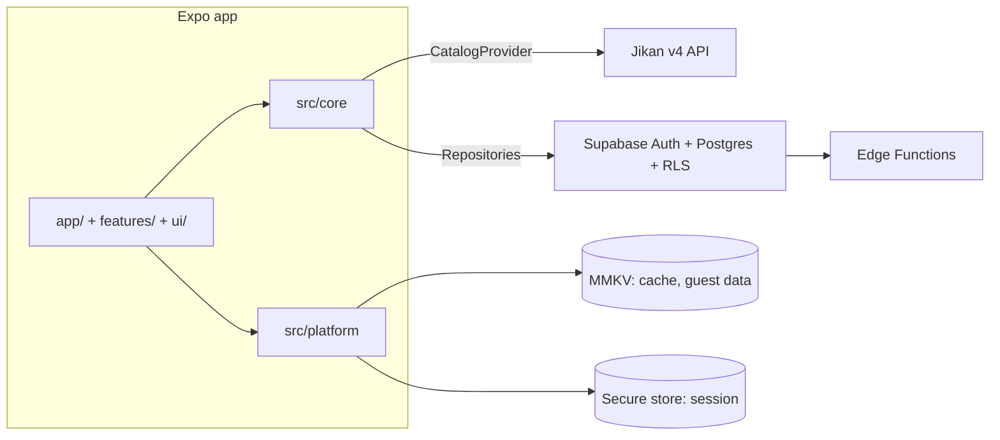
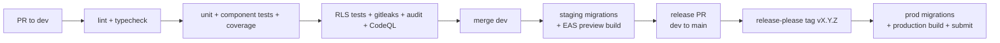

# Architecture

This document describes how Tsuzuki is built. Decisions and their rationale live in [`adr/`](./adr). Keep this file in sync with the code: any structural change updates it in the same PR.

## 1. Overview



- The **catalog** (titles, search, discovery) comes from an external provider, today Jikan, behind the `CatalogProvider` interface.
- **User data** (library, favorites, preferences) lives in Supabase for signed-in users, and in MMKV for guests.
- The app never talks to a provider or to Supabase outside `src/core/`.

## 2. Folder structure

```
tsuzuki/
├── app/                              # expo-router routes (thin)
│   ├── _layout.tsx                   # providers: query client, theme, i18n, auth
│   ├── (tabs)/
│   │   ├── _layout.tsx
│   │   ├── index.tsx                 # discovery
│   │   ├── search.tsx
│   │   ├── library.tsx
│   │   ├── favorites.tsx
│   │   └── settings.tsx
│   ├── media/[kind]/[id].tsx         # media detail
│   └── (auth)/sign-in.tsx, sign-up.tsx
├── src/
│   ├── core/                         # platform-agnostic, shareable with a future Next.js app
│   │   ├── domain/                   # entities, business rules (BR-xx), content filter
│   │   ├── schemas/                  # zod schemas for user input and db rows
│   │   ├── catalog/
│   │   │   ├── catalog-provider.ts   # CatalogProvider interface + normalized types
│   │   │   ├── rate-limiter.ts       # token bucket + request dedup
│   │   │   └── jikan/                # jikan adapter: http client, zod schemas, mappers, fixtures
│   │   ├── repositories/
│   │   │   ├── library-repository.ts # interfaces
│   │   │   ├── profile-repository.ts
│   │   │   ├── supabase/             # supabase implementations
│   │   │   └── local/                # guest implementations (storage injected from platform)
│   │   ├── hooks/                    # tanstack query hooks: useSearch, useMedia, useLibrary…
│   │   ├── query/                    # query client, query keys, stale times
│   │   ├── errors/
│   │   └── i18n/                     # en.json, fr.json, i18n setup
│   ├── features/
│   │   ├── search/                   # SearchBar, FiltersSheet, results + pagination
│   │   ├── discovery/
│   │   ├── library/
│   │   ├── media-detail/
│   │   ├── favorites/
│   │   ├── auth/
│   │   └── settings/
│   ├── ui/
│   │   ├── theme/                    # tokens: colors, spacing, radii, typography
│   │   └── components/               # Button, Text, Card, Input, Chip, Pagination, Sheet…
│   └── platform/
│       ├── storage.ts                # MMKV key-value storage implementing core StorageAdapter
│       ├── secure-session.ts         # expo-secure-store adapter for supabase-js auth storage
│       └── sentry.ts
├── supabase/
│   ├── migrations/
│   ├── functions/delete-account/
│   ├── tests/                        # pgTAP
│   └── seed.sql
├── e2e/                              # Maestro flows
├── docs/  (ARCHITECTURE.md, BACKLOG.md, adr/)
└── .github/workflows/
```

Layer rules are defined in `CONTRIBUTING.md` §4 and enforced by ESLint.

- Routes live in the root `app/`. Expo Router uses `src/app/` as the route root whenever it exists, so `src/app/` must never be created.
- Path aliases `@core/*`, `@features/*`, `@ui/*` and `@platform/*` map to the four `src/` layers. They are declared in `tsconfig.json` `paths` and resolved natively by Expo's Metro config, with no Babel plugin.
- Dependencies are installed with pnpm in its default isolated mode (no hoisting). pnpm settings, when needed, live in `pnpm-workspace.yaml`; `.npmrc` holds only auth and registry settings.

`src/ui/` components never call i18n: features translate and pass every label (visible text and accessibility labels) as props. This keeps `ui` independent of `core`.

## 3. Catalog provider adapter

All catalog access goes through one interface, so Jikan can be replaced or complemented (AniList, MangaUpdates) without touching screens.

```ts
// src/core/catalog/catalog-provider.ts
export type MediaKind = 'anime' | 'manga';

export interface MediaKey {
  kind: MediaKind;
  malId: number; // canonical id: jikan uses it natively, anilist exposes idMal
}

export interface MediaSummary {
  key: MediaKey;
  title: string;
  titleEnglish: string | null;
  imageUrl: string | null;
  format: MediaFormat;          // tv, movie, manga, manhwa, manhua, light_novel…
  status: MediaStatus;          // ongoing, finished, upcoming
  totalUnits: number | null;    // episodes or chapters, null when unknown
  score: number | null;
  year: number | null;
  genres: Genre[];
  isAdult: boolean;             // computed by the adapter (see §7)
}

export interface MediaDetail extends MediaSummary {
  synopsis: string | null;
  titleNative: string | null;
}

export interface SearchParams {
  kind: MediaKind;
  query?: string;
  formats?: MediaFormat[];
  genresIncluded?: number[];
  genresExcluded?: number[];
  status?: MediaStatus;
  year?: number;
  minScore?: number;
  sort?: { field: 'score' | 'popularity' | 'title' | 'start_date'; direction: 'asc' | 'desc' };
  page: number;
}

export interface Page<T> {
  items: T[];
  page: number;
  lastPage: number;
  hasNextPage: boolean;
}

export interface CatalogProvider {
  readonly id: 'jikan';
  search(params: SearchParams, signal?: AbortSignal): Promise<Page<MediaSummary>>;
  getDetail(key: MediaKey, signal?: AbortSignal): Promise<MediaDetail>;
  getTop(kind: MediaKind, page: number, signal?: AbortSignal): Promise<Page<MediaSummary>>;
  getCurrentSeason(page: number, signal?: AbortSignal): Promise<Page<MediaSummary>>;
  getGenres(kind: MediaKind): Promise<Genre[]>;
}
```

Adapter rules:

- Raw provider responses are parsed with Zod inside the adapter, then mapped to the normalized types. Nothing provider-specific leaks out.
- Every request goes through the shared `RateLimiter` (§6).
- The adapter never filters adult content in requests (ADR-0004).
- Adding a provider = a new folder next to `jikan/` + fixtures + contract tests reusing the same test suite.

## 4. Repositories

```ts
export interface LibraryRepository {
  list(filter: LibraryFilter): Promise<LibraryEntry[]>;
  get(key: MediaKey): Promise<LibraryEntry | null>;
  upsert(entry: LibraryEntryInput): Promise<LibraryEntry>;
  remove(key: MediaKey): Promise<void>;
}
```

Two implementations: `supabase/` for signed-in users and `local/` for guests. The active one is chosen by the auth state; hooks do not know which one they use.

Authentication also goes through a repository, so Supabase stays confined to `src/core/repositories/supabase/`:

```ts
export type OAuthProvider = 'google' | 'apple';

export interface AuthSession {
  userId: string;
}

export interface AuthRepository {
  signUp(email: string, password: string): Promise<void>; // sends the confirmation email
  signIn(email: string, password: string): Promise<AuthSession>;
  signInWithOAuth(provider: OAuthProvider): Promise<AuthSession>; // pkce
  resetPassword(email: string): Promise<void>; // sends the recovery email
  updatePassword(newPassword: string): Promise<void>; // submitted by the user after the recovery deep link
  signOut(): Promise<void>;
  onAuthStateChange(listener: (session: AuthSession | null) => void): () => void; // returns unsubscribe
  deleteAccount(): Promise<void>; // calls the delete-account edge function
}
```

Implemented in `src/core/repositories/supabase/`. The OAuth browser step (`expo-web-browser`) is mobile-only, so it is injected from `src/platform/` like the storage adapters.

## 5. Data model (Supabase)

```sql
-- profiles: one row per auth user
create table public.profiles (
  id uuid primary key references auth.users on delete cascade,
  username text unique check (char_length(username) between 3 and 30),
  preferences jsonb not null default '{}'::jsonb,  -- theme, language, showAdult
  created_at timestamptz not null default now(),
  updated_at timestamptz not null default now()
);

create type media_kind as enum ('anime', 'manga');
create type library_status as enum ('current', 'planned', 'completed', 'paused', 'dropped');

create table public.library_entries (
  id uuid primary key default gen_random_uuid(),
  user_id uuid not null references auth.users on delete cascade default auth.uid(),
  media_kind media_kind not null,
  mal_id integer not null check (mal_id > 0),
  -- per-user snapshot of the media, refreshed when the detail screen is viewed
  media_title text not null,
  media_image_url text,
  media_format text not null,
  media_total_units integer check (media_total_units > 0),
  media_is_adult boolean not null default false,
  status library_status not null default 'planned',
  progress integer not null default 0 check (progress >= 0),
  score smallint check (score between 1 and 10),
  notes text check (char_length(notes) <= 2000),
  is_favorite boolean not null default false,
  started_at date,
  finished_at date,
  created_at timestamptz not null default now(),
  updated_at timestamptz not null default now(),
  unique (user_id, media_kind, mal_id)
);

create index library_entries_user_status_idx on public.library_entries (user_id, status);
create index library_entries_user_updated_idx on public.library_entries (user_id, updated_at desc);
create index library_entries_user_favorite_idx on public.library_entries (user_id) where is_favorite;

-- progress history for future statistics, written by trigger only
create table public.progress_events (
  id bigint generated always as identity primary key,
  entry_id uuid not null references public.library_entries on delete cascade,
  user_id uuid not null references auth.users on delete cascade,
  from_progress integer not null,
  to_progress integer not null,
  created_at timestamptz not null default now()
);
```

- The media snapshot is stored **per user** in `library_entries` instead of a shared `media` table: a shared table writable by clients would let any user alter titles or image URLs seen by everyone.
- `updated_at` is maintained by a trigger; `progress_events` rows are inserted by a trigger on progress change, never by the client.
- There is no database check `progress <= media_total_units`: BR-01 is enforced in the domain on user edits, and a snapshot refresh must never fail when the provider total drops below the saved progress. The UI shows progress above total gracefully. To be finalized in F-08.
- Guest merge (BR-08) goes through a Postgres function (`security invoker`, so RLS applies) doing last-write-wins on a client-provided timestamp, since the `updated_at` trigger overwrites client values. To be finalized in A-04.

### Row Level Security

```sql
alter table public.profiles enable row level security;
alter table public.library_entries enable row level security;
alter table public.progress_events enable row level security;

create policy "own profile" on public.profiles
  for all to authenticated using (id = (select auth.uid())) with check (id = (select auth.uid()));

create policy "own entries" on public.library_entries
  for all to authenticated using (user_id = (select auth.uid())) with check (user_id = (select auth.uid()));

create policy "read own events" on public.progress_events
  for select to authenticated using (user_id = (select auth.uid()));
```

No policy grants anything to `anon`. Every policy has pgTAP tests (owner allowed, other user denied, anon denied).

## 6. Caching and performance

| Concern | Implementation |
| --- | --- |
| Query cache | TanStack Query. `staleTime`: media detail 24 h, top/season 6 h, search 10 min, genres 7 days, library 0 (always revalidated) |
| Persistent cache | Query cache persisted to MMKV (`persistQueryClient`), busted on app version change: instant start and offline reading |
| Query keys | Centralized factory in `src/core/query/keys.ts`: `['search', provider, params]`, `['media', kind, malId]`… |
| Rate limiting | Token bucket (3 req/s, 60 req/min, configurable per provider), in-flight dedup of identical requests, exponential backoff with jitter on 429/5xx, max 3 retries |
| Search | 400 ms debounce, `AbortController` cancels outdated requests (TanStack `signal`) |
| Pagination | One cache entry per `(params, page)`, `placeholderData: keepPreviousData`, prefetch of the next page when idle |
| Adult filter | Applied with `select` on cached data: toggling the setting never refetches |
| Images | `expo-image` with memory + disk cache, placeholder, size matched to the view |
| Lists | FlashList, memoized rows, stable keys |
| Writes | Optimistic updates; `+1` taps coalesced (500 ms) into one upsert; offline writes queued and replayed |
| Database | Indexes above; select only needed columns; library paginated with `range` |
| Bundle | Hermes, lazy routes, no heavy dependency without justification |

## 7. Adult content filter

- Providers are always queried without content filters (ADR-0004).
- The adapter sets `isAdult` when genres include Hentai or Erotica, or the anime rating is Rx.
- A pure function `applyContentFilter(items, showAdult)` in `src/core/domain/` is applied in hook `select`. Default `showAdult = false`.
- A filtered page can contain fewer items than the provider page size; the UI shows a subtle note instead of refetching.
- App store rating: 17+ (App Store) / PEGI 18 equivalent (Play). Before exposing the toggle on iOS, check the current App Store Review Guidelines (1.1.4).

## 8. Auth, session and guest mode

- Supabase Auth: email + password (email confirmation required), Google and Apple via OAuth PKCE.
- supabase-js `auth.storage` = secure-store adapter from `src/platform/secure-session.ts` (values chunked if over the secure-store size limit).
- Guest mode uses the `local` repositories. On first sign-in, `mergeGuestLibrary()` upserts local entries (most recent `updated_at` wins), then clears the guest store (BR-08).
- Sign out: `queryClient.clear()`, persisted cache and local user data purged.
- Account deletion: `delete-account` Edge Function verifies the caller's JWT, then deletes the auth user with the service role key; cascades remove all rows.

## 9. Security

Baseline: OWASP MASVS L1. Rules are in `CONTRIBUTING.md` §7. Summary:

| Threat | Mitigation |
| --- | --- |
| Reading or writing another user's data | RLS on every table + pgTAP tests in CI |
| Leaked privileged key | Only the anon key ships in the app; service role only in Edge Function secrets; gitleaks in CI |
| Token theft on device | Session in Keychain/Keystore via secure-store |
| Malicious provider payload | Zod parsing at the adapter boundary, rendering as text only |
| Malicious deep link | Route params validated with Zod; no write triggered by a link |
| Account takeover | Email confirmation, strong password policy, Supabase rate limits + captcha on auth endpoints |
| Vulnerable dependency | Renovate, `pnpm audit` (high blocks CI), CodeQL |
| Personal data in logs | No PII logging; Sentry `beforeSend` scrubbing |

## 10. Environments and CI/CD

| Environment | Supabase | EAS channel | Trigger |
| --- | --- | --- | --- |
| Local | `supabase start` (Docker) | dev client | developer |
| Staging | `tsuzuki-staging` project | `preview` | merge on `dev` |
| Production | `tsuzuki-prod` project | `production` | release tag `v*` on `main` |

### Branching model

| Branch | Role | Receives | Merge method |
| --- | --- | --- | --- |
| `dev` | Development/integration, deployed to staging; every PR targets it explicitly (`--base dev`) | PRs from `feat/*`, `fix/*`, `chore/*`, `docs/*`, `test/*` | Squash |
| `main` | Production, always releasable, GitHub default branch | Release PRs from `dev`, hotfix PRs | Merge commit |
| `hotfix/*` | Urgent production fix | Branched from `main`, merged into `main`, then `main` merged back into `dev` | Squash into `main` |



- Both `dev` and `main` are protected: PR only, no direct push, no force push, required status checks (lint, typecheck, test, rls, security).
- A release PR from `dev` to `main` also requires the E2E suite and the owner's approval.
- release-please runs on `main` and generates the version and changelog from conventional commits. After each release or hotfix, `main` is merged back into `dev` so they never diverge.
- JS-only fixes can ship with EAS Update on the matching runtime version; native changes require a store build.

## 11. Evolution paths

- **Web version**: Next.js app in a pnpm + Turborepo monorepo. `src/core/` moves to `packages/core` as is; the web app implements its own screens and a web `platform` layer (ADR-0006).
- **Dedicated backend**: if Edge Functions are not enough (shared Jikan cache, scheduled notifications), Next.js API routes or a dedicated service implement the same repository interfaces over HTTP; Postgres and Supabase Auth stay.
- **More providers**: AniList (GraphQL, good manhwa/manhua coverage), MangaUpdates (chapter releases) as new `CatalogProvider` adapters.
